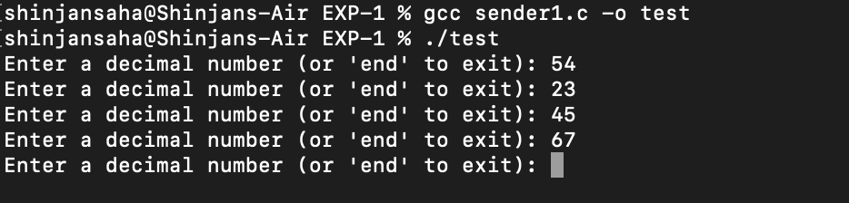
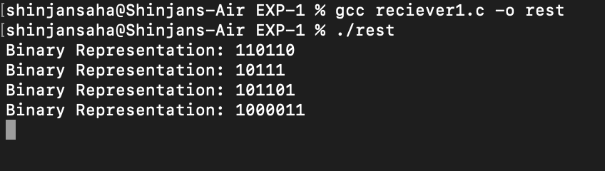

# IPC (Message queue)

# Objective:-
### Take a decimal number from user. Convert it to different bases (e.g.: 2,8,16 etc.) and send those values to message queue. Write three separate programs to read and display the binary, octal and hex value from the message queue distinctively.


# Note:- 

### Currently it works in Binary only


# Sender Code:-

```bash 
#include <stdio.h>
#include <stdlib.h>
#include <string.h>
#include <errno.h>
#include <unistd.h>
#include <sys/msg.h>

#define MAX_TEXT 512

struct my_msg_st {
    long int my_msg_type;
    char some_text[MAX_TEXT];
};

int decimalToBinary(int num) {
    long long int bin = 0;
    int place = 1;
    
    while (num > 0) {
        int remainder = num % 2;
        bin += remainder * place;
        num /= 2;
        place *= 10;
    }
    return bin;
}

int main() {
    int running = 1;
    struct my_msg_st some_data_bin;
    int msgid;
    char buffer[MAX_TEXT];

    msgid = msgget((key_t)1234, 0666 | IPC_CREAT);
    if (msgid == -1) {
        fprintf(stderr, "msgget failed with error: %d\n", errno);
        exit(EXIT_FAILURE);
    }

    while (running) {
        printf("Enter a decimal number (or 'end' to exit): ");
        fgets(buffer, MAX_TEXT, stdin);
        
        
        buffer[strcspn(buffer, "\n")] = 0;

        if (strncmp(buffer, "end", 3) == 0) {
            strcpy(some_data_bin.some_text, "end");
            some_data_bin.my_msg_type = 2;
        } else {
            int num = atoi(buffer);  
            int binary = decimalToBinary(num);
            snprintf(some_data_bin.some_text, MAX_TEXT, "%d", binary);
            some_data_bin.my_msg_type = 2;
        }

        if (msgsnd(msgid, (void*)&some_data_bin, MAX_TEXT, 0) == -1) {
            fprintf(stderr, "msgsnd failed\n");
            exit(EXIT_FAILURE);
        }

        if (strncmp(buffer, "end", 3) == 0) {
            running = 0;
        }
    }

    exit(EXIT_SUCCESS);
}

```


## Steps to Execute:-
```bash
gcc sender1.c -o test
```

```bash
./test
```

# Reciever Code:-

```bash
 #include <stdio.h>
#include <stdlib.h>
#include <string.h>
#include <errno.h>
#include <unistd.h>
#include <sys/msg.h>

#define MAX_TEXT 512

struct my_msg_st {
    long int my_msg_type;
    char some_text[MAX_TEXT];
};

int main() {
    int running = 1;
    int msgid;
    struct my_msg_st some_data;
    long int msg_to_receive = 2;

    msgid = msgget((key_t)1234, 0666 | IPC_CREAT);
    if (msgid == -1) {
        fprintf(stderr, "msgget failed with error: %d\n", errno);
        exit(EXIT_FAILURE);
    }

    while (running) {
        if (msgrcv(msgid, (void*)&some_data, MAX_TEXT, msg_to_receive, 0) == -1) {
            fprintf(stderr, "msgrcv failed with error: %d\n", errno);
            exit(EXIT_FAILURE);
        }

        if (strncmp(some_data.some_text, "end", 3) == 0) {
            printf("Terminating receiver.\n");
            running = 0;
        } else {
            printf("Binary Representation: %s\n", some_data.some_text);
        }
    }

    if (msgctl(msgid, IPC_RMID, 0) == -1) {
        fprintf(stderr, "msgctl(IPC_RMID) failed\n");
        exit(EXIT_FAILURE);
    }

    exit(EXIT_SUCCESS);
}

```

## Steps to Execute:-
```bash
gcc reciever1.c -o rest
```

```bash
./rest
```


# Working:-

## Sender Terminal:-



## Reciever Terminal:-
